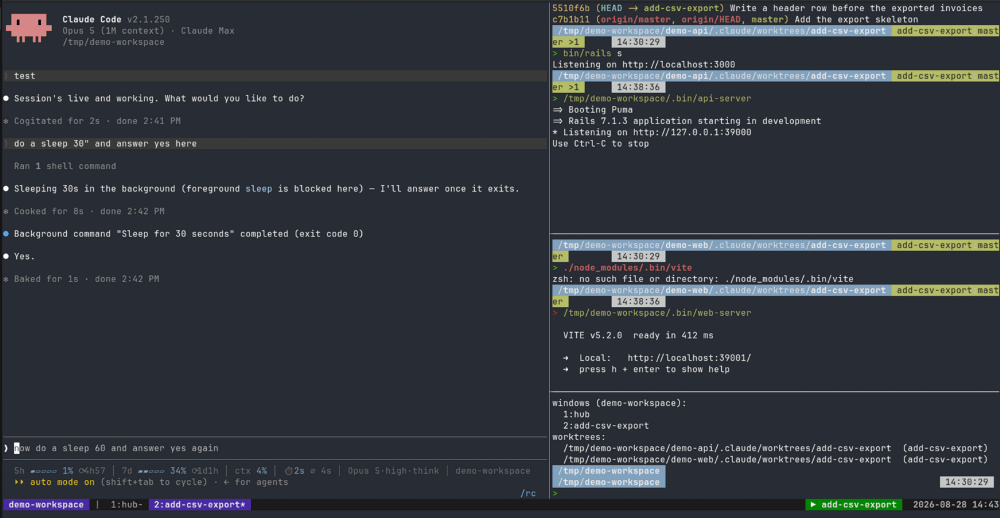
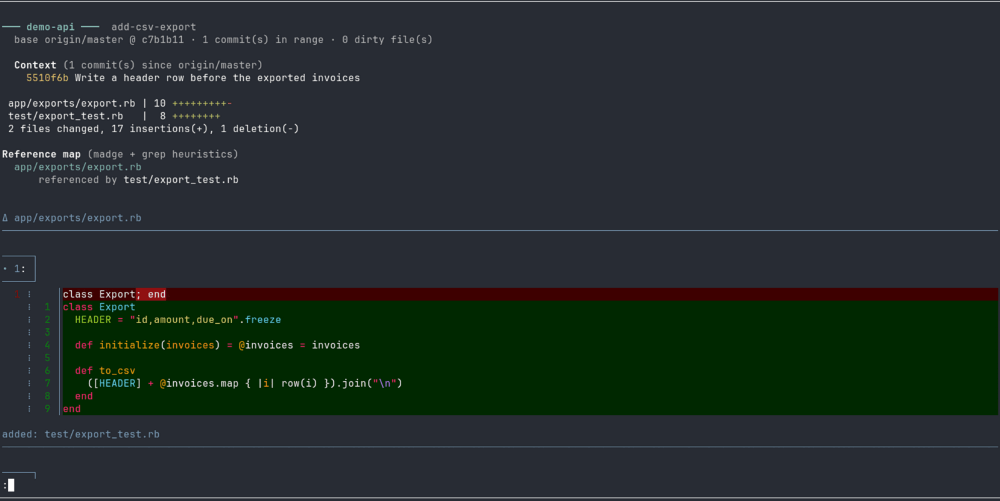

# claude-config

The portable half of a Claude Code setup: a development philosophy, the skills
and agents that carry it, and the tmux tooling that runs a task-per-window
workflow on top of git worktrees. Nothing here is specific to one employer or
one project — clone it onto any machine and it works.

**Deliberately absent: memory.** Claude Code keeps per-project memory under
`projects/<path-slug>/memory/`, and those files hold client-specific
engineering detail. They are gitignored and never leave the machine they were
written on. Their only backup is the disk; treat them accordingly.

## Install

`~/.claude` already exists on any machine where Claude Code has run — it holds
runtime state (credentials, history, plugins, caches). The allowlist in
`.gitignore` ignores all of it, so the repo can be laid down on top:

```bash
mkdir -p ~/.claude && cd ~/.claude
git init
git remote add origin git@github.com:pablocm90/claude-config.git
git fetch origin
git checkout -b main --track origin/main
```

Runtime state is untouched and `git status` comes back clean.

Then put the tooling on `PATH` and load the tmux config:

```bash
mkdir -p ~/.local/bin
ln -sf ~/.claude/bin/claude-dev ~/.claude/bin/claude-dev-review \
       ~/.claude/bin/claude-dev-status ~/.local/bin/
ln -sf ~/.claude/dotfiles/tmux.conf ~/.tmux.conf
```


This repo is public, so a guard refuses any commit carrying a client or vendor
name, a personal address or path, a credential, or a session id:

```bash
git config core.hooksPath .githooks
git config user.email "<your-github-noreply-address>"
```

Run it by hand with `bin/preflight`, or `bin/preflight --message <file>` to
check a commit message too. Extend the pattern lists at the top of
`bin/preflight` — never the habit of remembering to look.


Verify:

```bash
claude-dev --help
for t in ~/.claude/bin/test/*_test.sh; do bash "$t"; done
```

`settings.json` enables three plugins from the official marketplace
(`playwright`, `security-guidance`, `pr-review-toolkit`). Their code lives in
the gitignored `plugins/`, so on a new machine confirm they resolved with
`/plugin`.

## Dependencies

| | Needed for | If missing |
|---|---|---|
| `bash`, `git`, `tmux`, GNU coreutils/grep | everything | nothing works |
| `gh`, authenticated | PR/CI status pane, `claude-dev prune` | those two commands |
| `fuser` (psmisc) | `claude-dev serve` | serve cannot free its ports |
| `delta` | review pager | falls back to a plain pager |
| `xdg-open` | opening `--html` reports | report is written, not opened |
| `madge` + `jq` | exact TypeScript graph in `--html` | falls back to grep heuristics |

`madge` is used from the reviewed repo's own `node_modules/.bin`, never
globally.

## How it's used

The tooling exists to run one workflow: **many small strides, each reviewed by
a human**. `claude-dev` builds a tmux session where each task owns a window,
each window owns a git worktree, and reviews arrive automatically at the end
of every stride rather than being asked for.

A session looks like this:

```bash
claude-dev                       # hub window: Claude + a PR/CI status pane
claude-dev task fix-timezone     # new window on a worktree per repo
claude-dev task fix-timezone be  # ...or scoped to one repo (fragment match)
```



*Claude on the left with its statusline — context, plan windows, model, effort.
On the right, a shell per repo worktree and a workspace shell. Bottom right, the
green `▶` names whichever task currently holds the dev ports. Screenshots are of
a throwaway two-repo demo workspace, not a real project.*

The shells are already `cd`'d into their worktrees. Claude works in small
strides, committing at each green point. When a stride lands it calls:

```bash
claude-dev ready --note "what this stride did and what to look at"
```

which pops a review of **just that commit** over the window. You read it,
respond in the Claude pane, and the next stride starts. The note becomes the
review's opening paragraph, so you get the author's framing before the diff.



*A review: what changed and against what base, the diffstat, a reference map of
what calls the changed files, then the diff through `delta`.*

When a slice is coherent it is pushed and a PR opened by hand — the status
pane shows CI, and merging is always a human action. Afterwards:

```bash
claude-dev done fix-timezone     # drop the window and worktree (refuses if dirty)
claude-dev prune                 # sweep clean worktrees whose PR is merged
```

### `claude-dev`

| Command | |
|---|---|
| `claude-dev [--fresh] [folder]` | hub session: Claude pane + PR/CI status pane |
| `claude-dev task <slug> [repo…]` | task window on `<repo>/.claude/worktrees/<slug>`; repos match by fragment (`be`, `fe`) |
| `claude-dev ready [slug] [--note <text>]` | signal a green stride; flags it and pops its review |
| `claude-dev serve [slug] [--stop]` | run this task's dev stack, stopping every other one |
| `claude-dev serve-cmd [path]` / `serve-ports` | what serve would start, and on which ports |
| `claude-dev ls` | task windows and worktrees |
| `claude-dev done <slug>` | remove the window and worktree; refuses if dirty |
| `claude-dev prune [--yes]` | remove clean worktrees whose PR is merged or closed |

One task serves at a time: the workspace ports are global, so `serve` stops
every other task's stack before starting this one. It **kills** whatever holds
those ports.

### `claude-dev-review`

| Command | |
|---|---|
| `claude-dev-review <slug>` | terminal review across the task's worktrees |
| `claude-dev-review` | review the worktree containing `$PWD` |
| `claude-dev-review <slug> --stride` | only the last commit — what `ready` pops |
| `claude-dev-review <slug> --html [--no-open]` | standalone HTML report under `artifacts/` |

Each review opens with a Context block (the stride note, or the commits in
range), then a diffstat, then a reference map of what calls the changed files,
then the diff — piped through `delta` when it is installed.

### `claude-dev-status`

The PR/CI pane. Lists every repo and any *interesting* worktree — dirty, ahead
or behind, or carrying an open PR — and counts the idle ones. Loops on a timer;
`--once` prints a single snapshot.

### tmux keys

Prefix is `C-a`.

| Key | |
|---|---|
| `prefix + D` | open the PR/CI status pane |
| `prefix + r` | review the current task window in a popup |
| `prefix + S` | serve this task (clicking the `▶` block in the status bar does the same) |
| `prefix + X` | close the pane |
| `C-h/j/k/l` | move between panes, no prefix |
| `M-Left` / `M-Right` | previous / next window |

The status bar's `▶` block names whichever task currently holds the main port:
green when it is this window, grey when another task has it.

### Slash commands

| | |
|---|---|
| `/setup` | onboard a project: detect the stack, write its CLAUDE.md, hooks and commands |
| `/plan` | write a plan document on a branch, no code changes |
| `/continue` | after a merge: pull, branch, update the plan, pick up the next slice |
| `/cycle` | write the handoff and respawn this pane with a fresh session |
| `/diff` | working-tree diff stats for the folder and any subrepos |
| `/generate-pr-review` | generate project-specific PR review automation |

## Wiring a new project

The framework is generic; four things are per-project.

**The pre-push gate.** `mmmss-stride` requires one fast static gate before a
push and defers to the project for the command. Name it in the project's
`CLAUDE.md` — that file is the single source of truth for it.

**What `claude-dev serve` starts.** Detection covers Rails (`bin/rails s`) and
yarn (`yarn start`). Anything else writes one line:

```bash
echo 'uv run fastapi dev' > <repo>/.claude/serve
echo '8000 5173'          > <workspace>/.claude/ports   # default: 3000 4000
```

Ask what it resolved with `claude-dev serve-cmd` and `claude-dev serve-ports`.

**Worktrees.** `claude-dev task <slug>` cuts them at
`<repo>/.claude/worktrees/<slug>`; gitignore `.claude/` in the project.

**Onboarding.** Run `/setup` inside a new project to detect its stack and
generate a project `CLAUDE.md`, hooks and commands.

## Layout

| Path | |
|---|---|
| `CLAUDE.md` | philosophy, the mandatory skill-loading table, the skill map |
| `skills/` | 29 skills in four tiers; stack deltas in `resources/rails.md`, `resources/typescript.md` |
| `agents/` | subagent definitions |
| `commands/` | slash commands: `/setup`, `/plan`, `/cycle`, `/continue`, `/diff`, `/generate-pr-review` |
| `bin/` | `claude-dev` (tmux workspace), `claude-dev-review`, `claude-dev-status`, `statusline` |
| `bin/lib/refs.sh` | reference heuristics shared by the review and its tests |
| `bin/test/` | behaviour tests for the tooling |
| `dotfiles/tmux.conf` | prefix `C-a`; `prefix+D` status, `prefix+r` review, `prefix+S` serve |

## Portability notes

Honest limits, so nothing surprises you on a new stack:

- **Skills.** Of the 29, `typescript-strict`, `react-testing` and
  `front-end-testing` are TypeScript/React by nature; `oop` and
  `rails-performance` are Ruby. `functional` and `code-smells` carry
  TypeScript examples but apply anywhere. The rest are language-neutral.
  Stack guidance ships as `resources/rails.md` and `resources/typescript.md`.
- **The review's reference map** resolves Ruby, TypeScript, JavaScript and
  Python. Go, Rust and Java are left out on purpose: their imports do not name
  the file, so a filename grep answers with noise.
- **GNU-targeted.** `readlink -f`, `grep --exclude-dir` and `fuser` are
  assumed. macOS needs `coreutils` and `psmisc`, with `PATH` set so the GNU
  versions win.
- **`settings.json` turns four skills off** (`accessibility`, `diagrams`,
  `find-skills`, `rails-performance`). Re-enable in `/config` if you want them.
